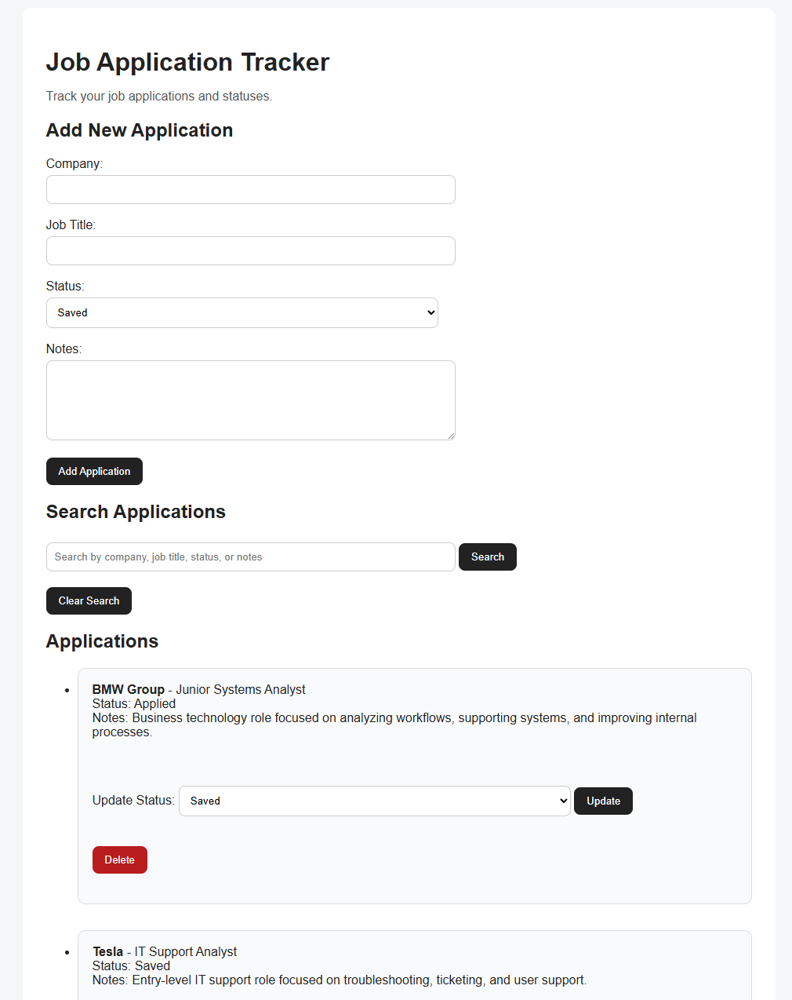

# Job Application Tracker

A Flask-based web application that helps users track job applications, application statuses, and notes in one place. This project started as a command-line Python job tracker and was upgraded into a web app with a form-based interface, CSV storage, search functionality, status updates, and delete options.

## About the Project

The Job Application Tracker was built to help organize the job search process. Instead of keeping track of applications manually in notes or spreadsheets, users can add job applications, view saved entries, update their status, search through applications, and delete records when needed.

This project also helped me practice turning a Python command-line program into a functional Flask web application.

## Features

* Add new job applications
* Track company, job title, location, date applied, job link, status, and notes
* Save applications to a CSV file
* View saved applications as styled application cards
* Search applications by company, job title, location, status, or notes
* Edit existing applications directly from the application card
* Delete applications
* Display status badges with different colors
* Basic CSS styling for a cleaner interface

## Technologies Used

* Python
* Flask
* HTML
* CSS
* CSV file storage
* Git and GitHub

## Project Structure

```text
job-tracker-app/
  app.py
  data/
  static/
    style.css
  templates/
    index.html
  README.md
  .gitignore
```

## How to Run the Project

1. Clone the repository:

```bash
git clone <your-repository-link>
```

2. Navigate into the project folder:

```bash
cd job-tracker-app
```

3. Create and activate a virtual environment:

```bash
python -m venv venv
venv\Scripts\activate
```

4. Install dependencies:

```bash
pip install -r requirements.txt
```

5. Run the Flask app:

```bash
python app.py
```

6. Open the app in your browser:

```text
http://127.0.0.1:5000
```

## Future Improvements

* Improve the visual design
* Add user authentication
* Replace CSV storage with SQLite
* Add dashboard statistics for application progress
* Add status-based color labels
* Deploy the application online

## Screenshots

## Home Page


